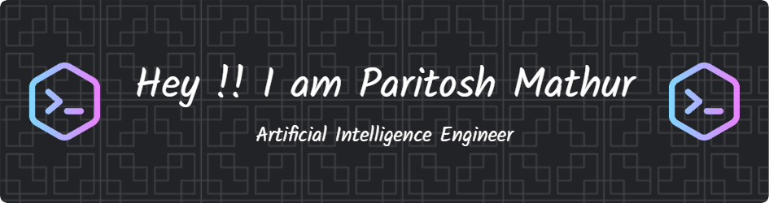

<h1 align="center">Hi 👋, I'm Paritosh Mathur</h1>

  

  

- 🔭 I’m currently working on **UnderBelly Restaurant Website**
- 👯 I’m looking to collaborate on **Machine Learning Projects**
- 🤝 I’m looking for help with **ML and Web Development**
- 🌱 I’m currently learning **MERN Stack**
- 💬 Ask me about **Machine Learning Concepts**
- 📫 How to reach me **paritoshmthr0106@gmail.com**
- ⚡ Fun fact **The First Computer Virus Was Created as a Prank 😂**

<h3 align="center">Connect with me:</h3>

<h3 align="center">Languages and Tools:</h3>

<h3 align="center">Stars</h3>

<h3 align="center">Statistics</h3>

<a href="https://github.com/paritxshh">

